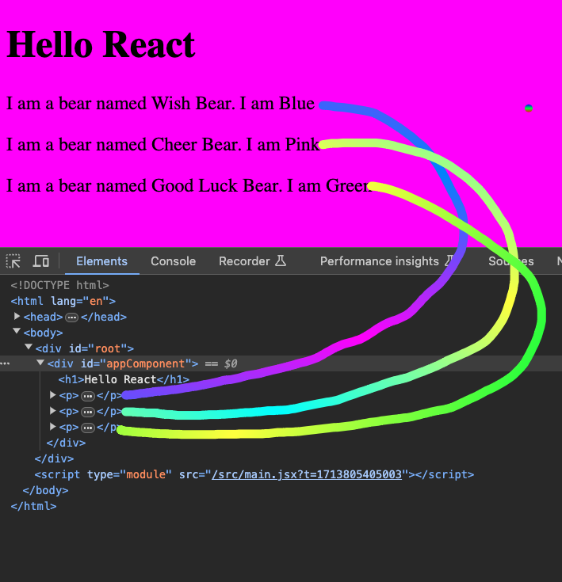
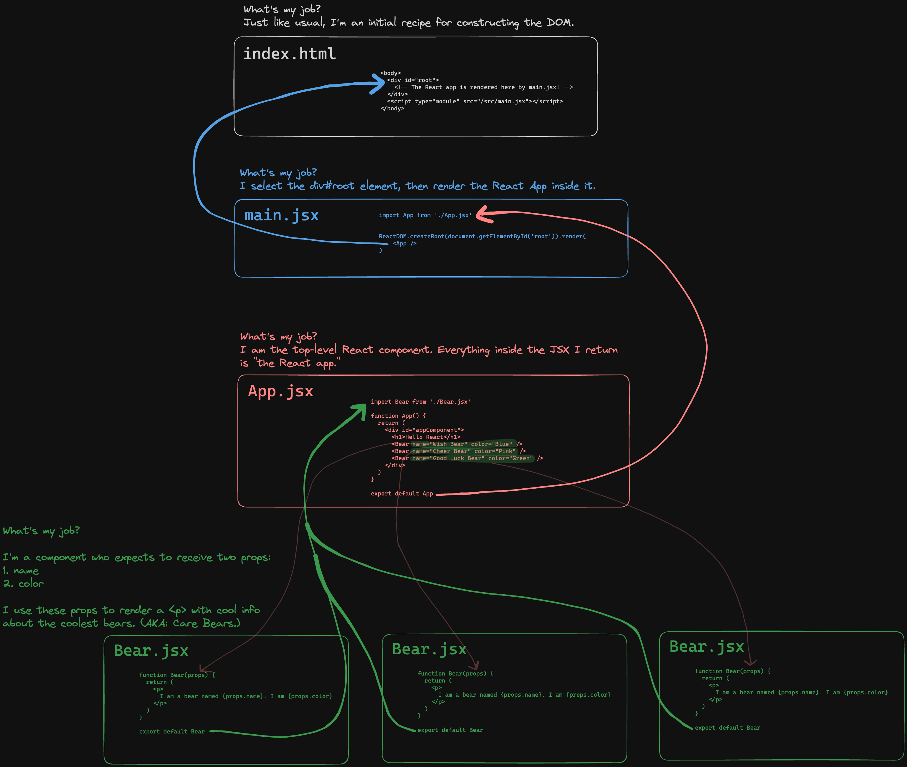
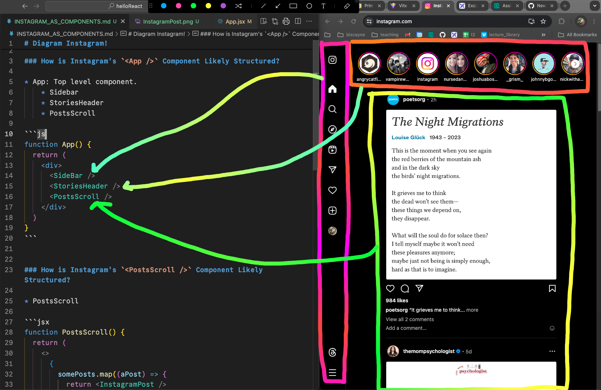
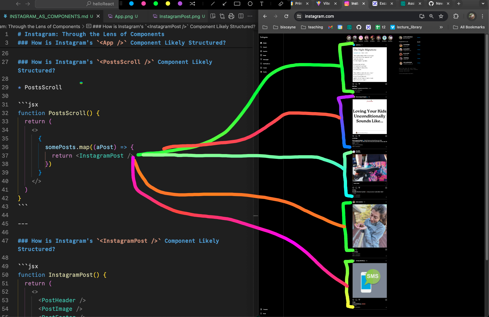
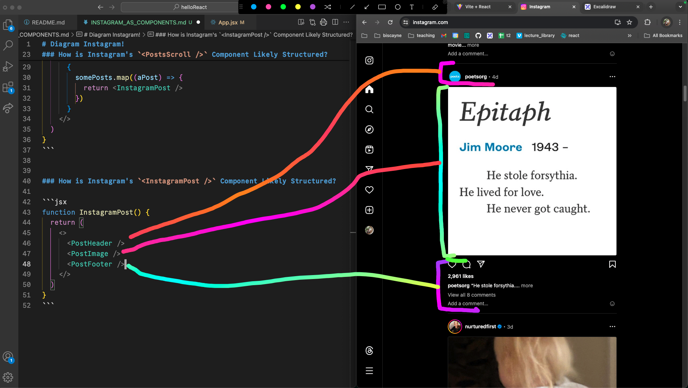

# Hello React

<details>
  <summary>Initial React Notes</summary>

  # Initial React Notes

  ## Why Does React Exist?

  * Compartmentalize!
      * Thanks to components!
  * Facebook's engineering team invented it to make it **easier to make Facebook**.

  ## Structure of a React App:

  * Top level is still `index.html`!
      * It's basically an empty box where React will render stuff.
  * `main.jsx` is where we use our Vanilla JS skills to select the `<div id="root">` element, then render our React app inside of it.
  * `App.jsx` is our React app! It's the top level component.

  ## Transpiling

  * A React app uses JSX, which cannot be directly rendered by a browser.
      * Browser only can read HTML|JS|CSS.
  * JSX needs to be "translated" or "compiled" into HTML|JS|CSS.
      * Hence, "transpiled."
  * The reason you must run your React app on a localhost port is because of this.
      * Every time you modify and save a file in your React app, Vite (or whatever build tool you're using) re-transpiles your app.
  * Vite is the "build tool" that does this process for us automatically!
      * `npm run dev` is what starts Vite. 🙂

</details>

<details>
  <summary>Diagram of the App We Made</summary>

  # Diagram of the App We Made

  ### The App We Made:

  

  ### How it Works:

  * [View this in Excalidraw](https://excalidraw.com/#json=Fa05ZHTP8NTBZIq1Da5TC,qURsgXhjNG39PrM-z6ulPA)

  

</details>


<details>
  <summary>Conceptualizing Instagram Through the Lens of Components</summary>

  # Instagram: Conceptualized Through the Lens of Components

  ### How is Instagram's `<App />` Component Likely Structured?

  ```js
  function App() {
    return (
      <div>
        <SideBar />
        <StoriesHeader />
        <PostsScroll />
      </div>
    )
  }
  ```

  

  ---


  ### How is Instagram's `<PostsScroll />` Component Likely Structured?

  * PostsScroll

  ```jsx
  function PostsScroll() {
    return (
      <>
        {
          somePosts.map((aPost) => {
            return <InstagramPost />
          })
        }
      </>
    )
  }
  ```

  

  ---

  ### How is Instagram's `<InstagramPost />` Component Likely Structured?

  ```jsx
  function InstagramPost() {
    return (
      <>
        <PostHeader />
        <PostImage />
        <PostFooter />
      </>
    )
  }
  ```

  
</details>
